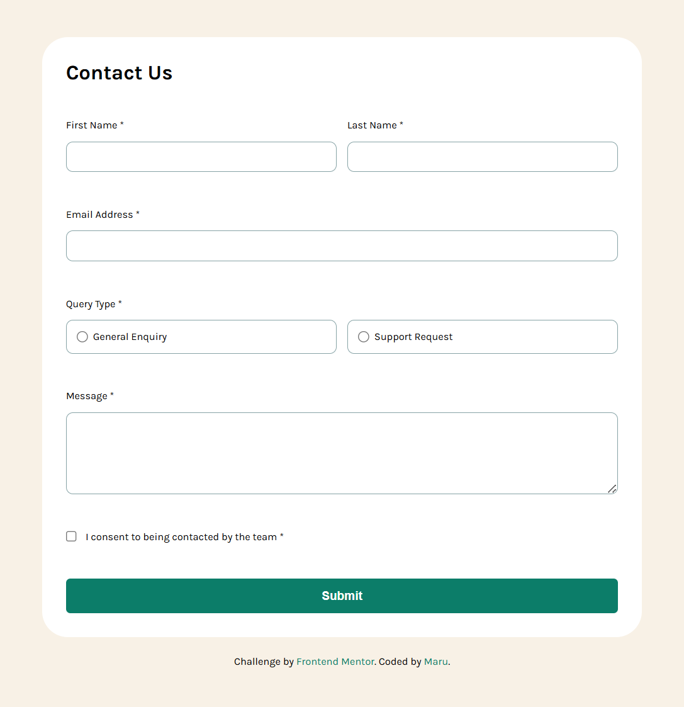
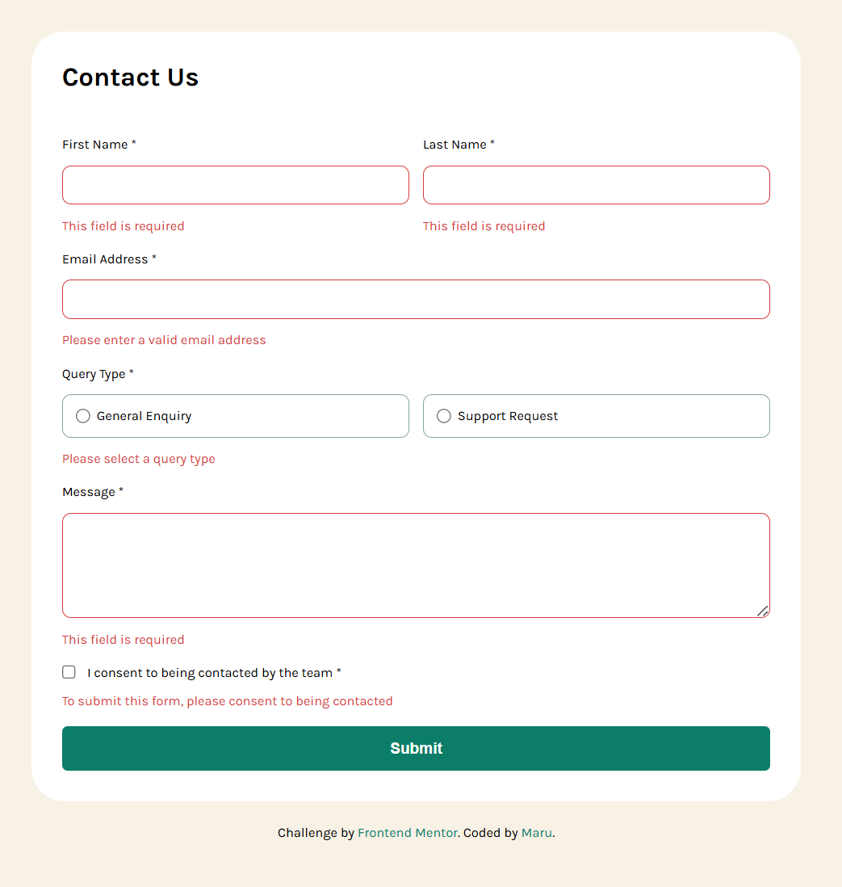
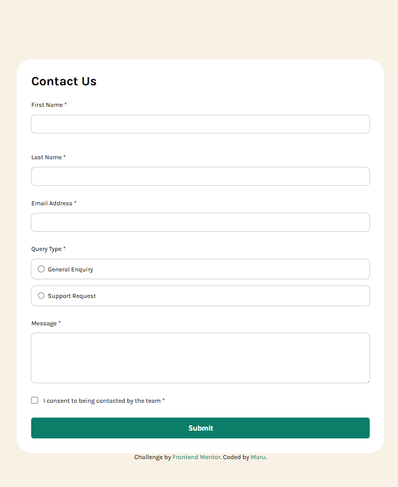

# Frontend Mentor - Contact form


This is a solution to the [Contact form challenge on Frontend Mentor](https://www.frontendmentor.io/challenges/contact-form--G-hYlqKJj). Frontend Mentor challenges help you improve your coding skills by building realistic projects.

## Table of contents

- [Overview](#overview)
  - [The challenge](#the-challenge)
  - [Screenshot](#screenshot)
  - [Links](#links)
- [My process](#my-process)
  - [Built with](#built-with)
  - [What I learned](#what-i-learned)
  - [Continued development](#continued-development)
- [Author](#author)

## Overview

### The challenge

Users should be able to:

- Complete the form and see a success toast message upon successful submission
- Receive form validation messages if:
  - A required field has been missed
  - The email address is not formatted correctly
- Complete the form only using their keyboard
- Have inputs, error messages, and the success message announced on their screen reader
- View the optimal layout for the interface depending on their device's screen size
- See hover and focus states for all interactive elements on the page

### Screenshot








### Links

- Solution URL: [Add solution URL here](https://your-solution-url.com)
- Live Site URL: [Add live site URL here](https://your-live-site-url.com)

## My process

### Built with

- Semantic HTML5 markup
- CSS custom properties
- Flexbox
- JavaScript

**Note: These are just examples. Delete this note and replace the list above with your own choices**

### What I learned

- Creating reusable validation functions in JavaScript
- Dynamically toggling error messages and success messages using `classList`
- Using `form.reset()` to clear input values after submission
- Improving UX by showing a success banner without hiding the form

```JavaScript
  const validateField = (inputEl, containerEl) => {
    const isEmpty = inputEl.value.trim() === "";
    containerEl.classList.toggle("error", isEmpty);
    return !isEmpty;
  };

  if (
    isFirstNameValid &&
    isLastNameValid &&
    isEmailValid &&
    isQueryTypeValid &&
    isMessageValid &&
    isConsentValid
  ) {
    successMessage.classList.remove("hidden");
    form.reset();
  }

  setTimeout(() => {
    successMessage.classList.add("hidden");
  }, 5000);
```

### Continued development

- Enhancing the UI/UX with animations or smoother error messaging.
- Toggle between light and dark themes

## Author

- Frontend Mentor - [@zerowater](https://www.frontendmentor.io/profile/zerowater4704)
- Twitter - [@jnyngxi188584](https://www.x.com/jnyngxi188584)
